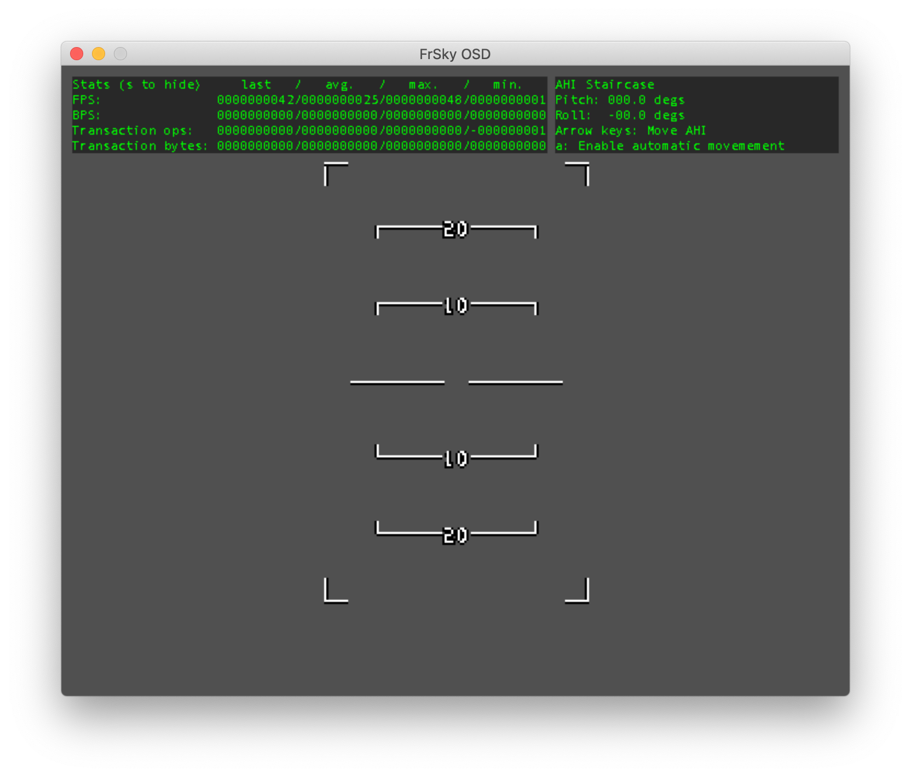
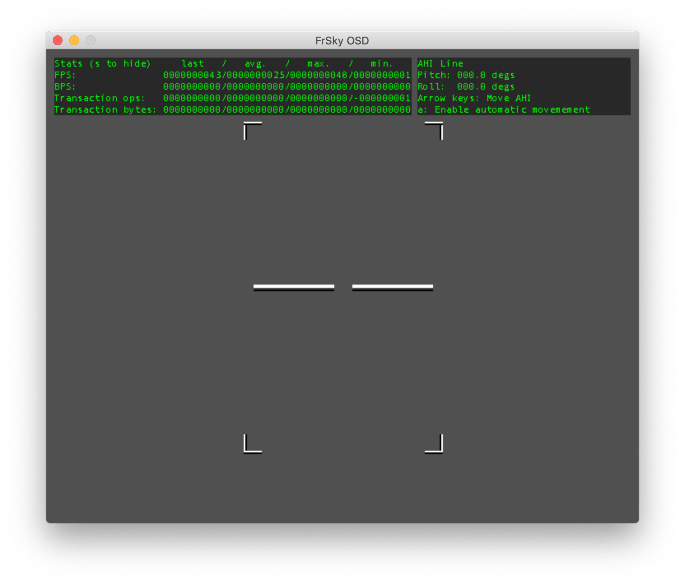
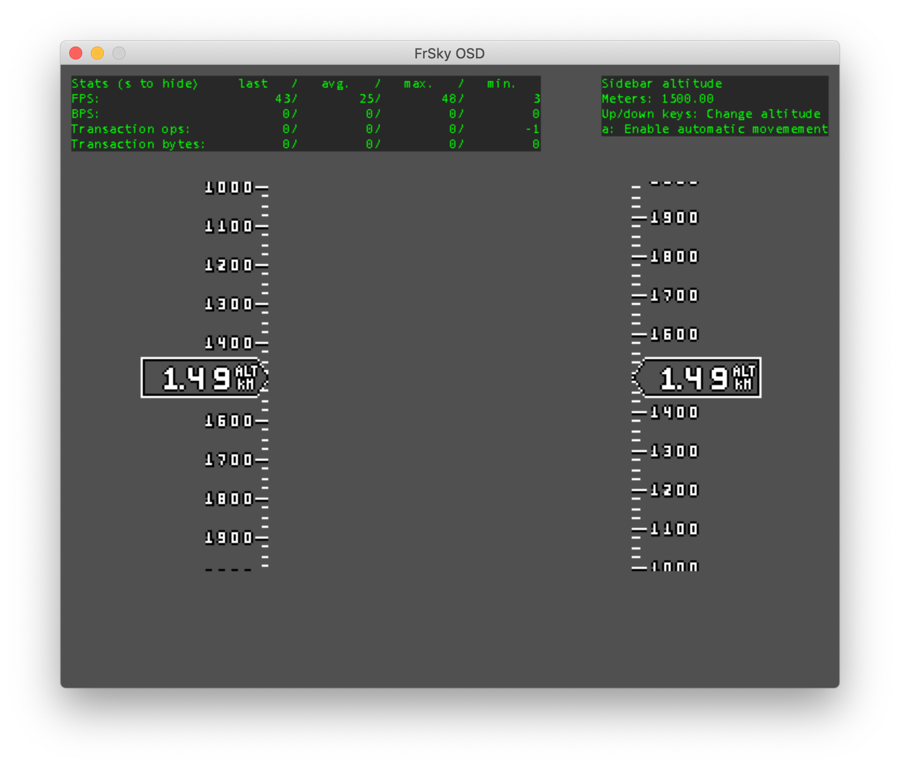
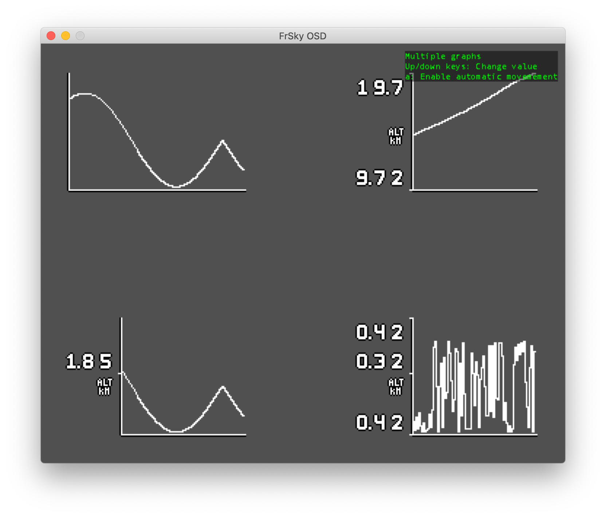

FrSky OSD Widgets
=================

Since version 2 FrSky OSD includes a high level widget system that allows
drawing highly detailed pixel indicators with minimal support on the host
side as well as transferring very small amounts of data.

## Overview

In order to use a widget, first it must be configured via `OSD_CMD_WIDGET_SET_CONFIG`.
Then, it can be drawn and updated using `OSD_CMD_WIDGET_DRAW`. Note that widgets know
how to redraw themselves, so the `OSD_CMD_WIDGET_ERASE` API for erasing a widget should
only be used when the host wants to remove the widget from the screen.

Widgets will push the drawing context before drawing themselves and pop it after they're
done. However, note that not all drawing state is part of the context. For this reason,
you shouldn't rely on any state set up by the widgets to perform other operations
without explicitely configuring the parameters you need.

Finally, widgets make a few assumptions about the OSD font:

- `A (0x41)` must represent the capital A character and the rest of the uppercase
  alphabet must follow it.
- `0 (0x30)` must represent the number `0` character and the rest of the digits
  up to `9` must follow it.
- `. (0x2E)` must represent the decimal separator point.
- `- (0x2D)` must represet the minus symbol

## Widget configuration

In order to configure a widget, send a `OSD_CMD_WIDGET_SET_CONFIG` call followed by the
`widget_id (uint8_t)`, then followed by the widget specific data that is indicated in
its documentatation.

Some widgets have additional restrictions and won't accept any arbitrary configuration. In
those cases, `OSD_CMD_WIDGET_SET_CONFIG` will return an error. To get a more detailed error
message, please test your code against the [FrSky OSD Simulator](https://github.com/FrSkyRC/PixelOSD)
and it will print a fully detailed error message to the console when the widget configuration
is incorrect.

## Units
Some widgets take a `osd_unit_t` as part of their configuration. This unit is used to display
the value to the user with the appropriate symbol (if any) and, optionally, change to a bigger
unit when the initial unit has too many significant digits. `osd_unit_t` is defined by the
following struct:

```c
typedef struct osd_unit_s
{
    uint16_t scale;          // The scale between the value and the represented unit. e.g. if you're providing cms but you want to draw meters this should be 100 ([0, 1023])
    uint16_t symbol;         // Symbol to append/prepend to the value when it's not scaled [0, 511]
    uint16_t divisor;        // If abs(value) > divisor, divide it by this. e.g. for meters and km you'd set this to 1000 [0, UINT16_MAX)
    uint16_t divided_symbol; // Symbol to append/prepend to the value when it's divided (e.g. the km symbol) [0, 511]
} __attribute__((packed)) osd_unit_t;
```

## Widget drawing

To draw a widget, call `OSD_CMD_WIDGET_DRAW` followed by its `widget_id` and its widget
specific data that's detailed in the widget specific documentation. Some widgets interprete
font character metadata for better rendering. Please, the [METADATA documentation](METADATA.md)
for more information.

## Avaible widgets

The available widgets in version 2 are represented by an `uint8_t`
with the following possible values:

```c
WIDGET_ID_AHI = 0           // AHI Widget - single instance
WIDGET_ID_SIDEBAR_0 = 1     // Sidebar with optional scrolling
WIDGET_ID_SIDEBAR_1 = 2     // Second instance of sidebar widget
WIDGET_ID_GRAPH_0 = 3,      // Graph with optional labels
WIDGET_ID_GRAPH_1 = 4,      // Second instance of graph widget
WIDGET_ID_GRAPH_2 = 5,      // Third instance of graph widget
WIDGET_ID_GRAPH_3 = 6,      // Fourth instance of graph widget
```

# AHI Widget

The AHI widget draws an artificial horizon indicator depending on pitch and roll. To configure the AHI widget, send `OSD_CMD_WIDGET_SET_CONFIG` followed by `WIDGET_ID_AHI` and the following payload:

```c
typedef struct widget_ahi_config_s
{
    osd_rect_t rect;
    widget_ahi_style_t style : 8;
    uint8_t options;
    uint8_t crosshair_margin;
    uint8_t stroke_width;
} __attribute__((packed)) widget_ahi_config_t;
```

Where:

### rect
Is an arbitrary rectangle representing the screen area where the
AHI will be drawn.

### style

Consist of an enum with the following values:

```c
typedef enum
{
    WIDGET_AHI_STYLE_STAIRCASE = 0, // Staircase with multiple lines
    WIDGET_AHI_STYLE_LINE = 1,      // Single horizon line
} widget_ahi_style_t;
```

### options

Is a list of flags where the following bits are used. Non documented
bits are reserved and should be set to zero.

```c
typedef enum
{
    WIDGET_AHI_OPTION_SHOW_CORNERS = 1 << 0, // Draw the corners of the rect used by the AHI
} widget_ahi_options_t;
```

### crosshair_margin

Is the width of the margin left around the center line to draw a
crosshair in the middle.

###  stroke_width

Represents the stroke width of the lines drawn by the AHI. Set it
zero to use the default values, which are `1` for `WIDGET_AHI_STYLE_STAIRCASE`
and `2` for `WIDGET_AHI_STYLE_LINE`.


To draw the AHI widget, call `OSD_CMD_WIDGET_DRAW` followed by `WIDGET_ID_AHI`
and the following payload:

```c
typedef struct
{
    uint16_t pitch : 12;
    uint16_t roll : 12;
} __attribute__((packed)) widget_ahi_pitch_roll_t;
```

Pitch are roll are quantized from a full rotation to the `[0, 4096)` interval,
where `(0, 0)` indicates the horizon is parallel to the ground. Positive pitch
values indicate up while positive roll values indicate clockwise rotation.

### AHI with staircase style



### AHI with line style




# Sidebar widget

The sidebar widget displays a sidebar with optional scrolling and a fixed width label. There
are two instances of this widget, that can be configured and drawn independently. To configure a
sidebar widget, send `OSD_CMD_WIDGET_SET_CONFIG` followed by `WIDGET_ID_SIDEBAR_x` and the following payload:

```c
typedef struct widget_sidebar_config_s
{
    osd_rect_t rect;
    uint8_t options;
    uint8_t divisions;        // How many divisions the sidebar will have
    uint16_t counts_per_step; // How much the value increases/decreases per division BEFORE applying the unit scale
    osd_unit_t unit;          // The unit used to display the values in the sidebar
} __attribute__((packed)) widget_sidebar_config_t;
```

Where:

### rect

Represents the rect where the sidebar will be drawn. You should take into account the number of
characters that you want to display in the main label of the sidebar (if any) as well as the
values that will appear in small labels when selecting the width. For example, to display
up to 3 digits with positive and negative values and a symbol, you should make the rect at least
5 character slots (i.e 60 pixels). Note that the sidebar won't erase the whole rect, so you can
place other elements in the same area as long as they don't overlap with the center label.

### options

Is a list of flags where the following bits are used. Non documented
bits are reserved and should be set to zero.

```c
typedef enum
{
    WIDGET_SIDEBAR_OPTION_LEFT = 1 << 0,      // Display the sidebar oriented to the left. Default is to the right
    WIDGET_SIDEBAR_OPTION_REVERSE = 1 << 1,   // Reverse the sidebar direction, so positive values move it down
    WIDGET_SIDEBAR_OPTION_UNLABELED = 1 << 2, // Don't display the central label with the value.
    WIDGET_SIDEBAR_OPTION_STATIC = 1 << 3,    // The sidebar doesn't scroll nor display values along it.
} widget_sidebar_options_t;
```

To draw the sidebar widget, call `OSD_CMD_WIDGET_DRAW` followed by `WIDGET_ID_SIDEBAR_x`
and the following payload:

```c
typedef struct widget_sidebar_draw_s
{
    int32_t value : 24;
} __attribute__((packed)) widget_sidebar_draw_t;
```

Note that the value is a 24 bit signed integer. This would provide a range of e.g. +-167km
counting centimeters. Note, however, than the host is able to change the scale of the sidebar
at any time, so it could dynamically switch to a range with less precission to represent
bigger values

### Metadata usage

The sidebar widget makes use of the following metadata:

- `s on -`: If the `-` symbol declares the size in pixels in takes, it's drawn with the given
    size. Otherwise, it's assumed it needs a whole character slot.
- `o on .`: If the `.` symbol declares an offset in pixels, it's applied when drawing it to
    align it better with the numbers. Otherwise, it's assumed it can be drawn in the middle
    of 2 digits and aligned at the same height.


### Two sidebars with opposite scroll directions

This picture shows an example with 2 sidebars representing altitude, but scrolling in
opposite directions. Using `scale` and `divisor`, the sidebars are able to represent `cm`
level accuracy for up to `+-10m`, then reduce the accurary to keep showing the same amount
of significant digits. Once the absolute value goes over `1km`, it automatically switches
to displaying `km` (using `divisor` and `divided_unit`).




# Graph widget

The graph widget displays an autoscaling and autoshifting graph that displays a value over time.
Each time a new value is provided, all graph is shifted 1 pixel to the left and the new value is
appended to the existing ones. By default, graphs are updated every time a new value is added. If
you have a very frequenly updated graph, you can batch updates in groups of 4 pixels to increase
performance by using the `WIDGET_GRAPH_OPTION_BATCHED` option.

Due to the implementation of the graph, you should make sure no other elements are drawn over it,
since the graph doesn't store the raw values you send it and instead manipulates the video memory
directly to use it as storage.

There are 4 instances of this widget. To configure a graph widget, send `OSD_CMD_WIDGET_SET_CONFIG`
followed by `WIDGET_ID_GRAPH_x` and the following payload:

```c
typedef struct widget_graph_config_s
{
    osd_rect_t rect;
    uint8_t options;
    uint8_t y_label_count; // The amount of labels to draw next to the y axis [0, 7]
    uint8_t y_label_width; // The width of each label in character slots including the unit [0, 15]
    uint8_t initial_scale; // The log2 of the initial scale of the graph (i.e. initial_scale = 3, means the scale will be 8 initially)
    osd_unit_t unit;       // The unit used to draw the y labels
} __attribute__((packed)) widget_graph_config_t;
```

Where:

### options

```c
typedef enum
{
    WIDGET_GRAPH_OPTION_BATCHED = 1 << 0, // Batch updates in groups of 4
} widget_graph_options_t;
```

### Special considerations

For increasing effiency, a graph widget must be aligned on a 4 bit boundary and its width must
be a multiple of 4 too. Otherwise, configuring it will return an error.

To draw a graph widget, call `OSD_CMD_WIDGET_DRAW` followed by `WIDGET_ID_GRAPH_x`
and the following payload:

```c
typedef struct widget_graph_draw_s
{
    int32_t value : 24;
} __attribute__((packed)) widget_graph_draw_t;
```

### Metadata usage

The graph widget will use the metadata on the `.` character in the same way as the sidebar widget.




# Char based gauge widget

The char based gauge widget draws a small rectangle shaped gauge on top of on a single
character by splitting it into two regions of different colors. It's typically used to display a
battery indicator.

There are 4 instances of this widget. To configure a char gauge widget, send `OSD_CMD_WIDGET_SET_CONFIG`
followed by `WIDGET_ID_CHARGAUGE_x` and the following payload:

```c
typedef struct widget_chargauge_config_s
{
    osd_point_t point; // Top left point for the first char
    uint16_t chr;      // First character for the gauge. Must contain the metadata
} __attribute__((packed)) widget_chargauge_config_t;
```

To draw the a chargauge widget, call `OSD_CMD_WIDGET_DRAW` followed by `WIDGET_ID_CHARGAUGE_x`
and the following payload:

```c
typedef struct widget_chargauge_draw_s
{
    uint8_t value;
} __attribute__((packed)) widget_chargauge_draw_t;
```

### Metadata usage

Chargauge widgets use the following metadata from the `chr` provided in `widget_chargauge_config_t`:

- `r on chr`: Defines the rect to paint over the character.
- `c on chr`: Defines the color used to paint over the character. Filled region will use the
  first color, while the unfilled region will use the second one. Third and fourth color are
  ignored and can be set to any value.
- `o on chr`: The offset defines the direction for determining the filled and unfilled region on
  top of the painted rectangle based on the sign of `x` and `y`. `x < 0` indicates an horizontally
  filling region starting from the right, while `x > 0` makes the widget fill from the left. `y < 0`
  will fill the region vertically starting from the bottom and growing to the top, while `y > 0` causes
  it to fill in the opposite direction. If both `x` and `y` are non-zero, `x` will take precedence.


If the character is missing any of the required metadata, `OSD_CMD_WIDGET_SET_CONFIG` will return
an error.